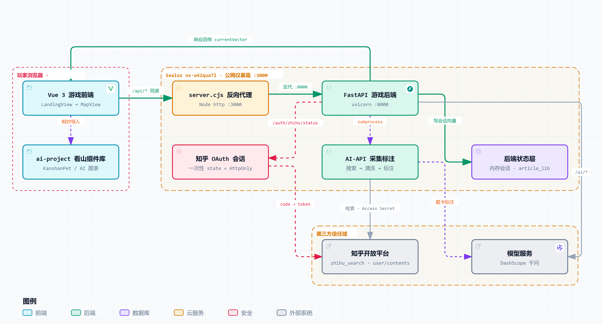

# 旅行看山：答主之路 (Zhihu Article Game)

一款基于知乎真实文章内容的阅读理解 + 卡牌收集 + AI 创作游戏。玩家在真实文章中划线收集「理解卡牌」，通过矩阵向量配卡系统组合文章，并由 AI 实时生成个性化内容。

## 核心玩法

- **文章阅读** — 从知乎搜索或本地文章库中随机获取真实文章
- **划线收集** — 在文章中划线，系统判定是否命中预设理解点，或动态生成卡牌
- **四类卡牌** — 观点卡 / 情绪卡 / 漏洞卡 / 修辞卡，各有独立数值体系
- **矩阵配卡** — 将卡牌放入 5 槽创作台，二维向量实时计算文章走向
- **AI 文章生成** — 根据卡槽快照，由 LLM 逐段生成本局专属文章
- **AI 看山** — AI 角色「看山」提供实时点评、聊天互动和局间 ADV 剧情
- **知乎登录** — 支持知乎 OAuth 授权，获取用户公开资料

## 技术栈

| 层级 | 技术 |
|------|------|
| **前端** | Vue 3 + TypeScript + Vite + TailwindCSS 4 + Pinia + XState |
| **后端** | Python 3.12 + FastAPI + Uvicorn |
| **AI/LLM** | 通义千问 (DashScope) / OpenAI 兼容 / DeepSeek（三级 failover） |
| **内容源** | 知乎开放平台搜索 API + LLM 自动标注 |

## 系统架构



## 项目结构

```
├── Backend/              # Python 后端
│   ├── game/            # 核心游戏逻辑
│   │   ├── api/         # FastAPI 端点 + LLM 集成
│   │   ├── numerics/    # 卡牌数值系统 + 矩阵向量运算
│   │   └── preprocess/  # 知乎搜索 + LLM 标注流水线
│   ├── article_lib/     # 文章 JSON 数据库
│   ├── template_lib/    # 文章-AI随笔生成模板库
│   ├── tests/           # 测试套件
│   ├── main_api.py      # 启动入口
│   └── pyproject.toml
├── Frontend/             # Vue 3 前端
│   ├── src/
│   │   ├── components/  # Vue 组件 (37)
│   │   │   ├── map/        # 地图导航
│   │   │   ├── article/    # 文章阅读
│   │   │   ├── achievement/# 成就系统
│   │   │   ├── crafting/   # 背包 / 工作台 / 卡牌
│   │   │   ├── settlement/ # 结算 / 总结
│   │   │   ├── ai-pet/     # 看山宠物 + 聊天 + 图表
│   │   │   └── story/      # 剧情对话
│   │   ├── services/    # API 调用层
│   │   ├── stores/      # Pinia 状态管理
│   │   ├── game/        # 游戏引擎 (状态机/事件/剧情/拖拽/写作)
│   │   ├── data/        # 静态配置数据
│   │   ├── types/       # TypeScript 类型定义
│   │   └── views/       # 页面视图
│   └── server.cjs       # 生产静态服务 + API 代理
```

## 快速开始

### 1. 环境变量配置

复制 `.env.example` 为 `.env`，填入实际凭据：

```bash
cp .env.example .env
```

主要需要配置：
- `TONGYI_API_KEY` — 通义千问 API Key（阿里云百炼平台获取）
- `TONGYI_API_BASE_URL` — 通义千问 OpenAI 兼容端点（如 `https://dashscope.aliyuncs.com/compatible-mode/v1`）
- `DASHSCOPE_NATIVE_API_BASE_URL` — DashScope 原生端点（如 `https://dashscope.aliyuncs.com/api/v1`），文章预处理管道使用
- `ZHIHU_OAUTH_APP_ID` / `ZHIHU_OAUTH_APP_KEY` — 知乎开放平台应用凭据
- `ZHIHU_ACCESS_SECRET` — 知乎 Access Secret（用于用户 API）

可选的备用 LLM 提供商（三级 failover）：
- `BACKUP_LLM_API_BASE_URL` / `BACKUP_LLM_API_KEY` — OpenAI 兼容协议的备用提供商
- `DEEPSEEK_API_KEY` — DeepSeek（`DEEPSEEK_API_BASE_URL` 默认 `https://api.deepseek.com`）

### 2. 启动后端

```bash
cd Backend
pip install .
python main_api.py
# 后端运行在 http://localhost:8000
```

### 3. 启动前端

```bash
cd Frontend
pnpm install    # 或 npm install
pnpm dev        # 或 npm run dev
# 前端运行在 http://localhost:5173
```

Vite 开发服务器已配置 `/api` 代理到 `http://localhost:8000`。

### 4. AI 文章生成（可选）

```bash
cd Backend
python -m game.preprocess.zhihu_pipeline "黑客松" 3
# 生成的文章自动存入 Backend/article_lib/
```

## 后端 API 概览

| 端点 | 方法 | 说明 |
|------|------|------|
| `/api/articles/random` | GET | 随机获取文章（支持 AI 文章自动补充） |
| `/api/judge` | POST | 划线判定（预设点匹配 + 动态卡兜底） |
| `/api/cards/dynamic` | POST | AI 辅助动态划线（主路径） |
| `/api/articles/generate` | POST | 局末文章生成（卡槽快照 → AI 写作） |
| `/api/workspace/vectors` | POST/GET | 配卡向量运算 |
| `/api/ai/comment` | POST | 看山一句话点评 |
| `/api/ai/chat` | POST | 看山聊天 |
| `/api/ai/story` | POST | 局间 ADV 剧情生成 |
| `/api/ai/hint` | POST | 文章阅读提示（规则/AI 双模式） |
| `/api/auth/zhihu/*` | GET/POST | 知乎 OAuth 登录流程 |
| `/api/health` | GET | 健康检查 |


## 卡牌数值系统

四类卡牌各有独立的数值量纲：

- **观点卡** — 整数向量，表示论证强度
- **情绪卡** — 整数向量，表示情感张力
- **漏洞卡** — 整数向量，表示逻辑缺陷程度
- **修辞卡** — 浮点乘数，表示表达增益倍率

卡牌放入创作台后，系统通过矩阵向量运算生成二维坐标 (heat, salt)，决定生成文章的基调和结构。

## 环境变量说明

| 变量 | 说明 | 必填 |
|------|------|------|
| `TONGYI_API_KEY` | 通义千问 API Key | 是（AI 功能） |
| `TONGYI_API_BASE_URL` | 通义千问 OpenAI 兼容端点 | 是（AI 功能） |
| `DASHSCOPE_NATIVE_API_BASE_URL` | DashScope 原生端点（文章预处理） | 是（文章预处理） |
| `BACKUP_LLM_API_BASE_URL` | 备用 LLM 端点（OpenAI 兼容） | 否 |
| `BACKUP_LLM_API_KEY` | 备用 LLM Key | 否 |
| `DEEPSEEK_API_BASE_URL` | DeepSeek 端点（默认 `https://api.deepseek.com`） | 否 |
| `DEEPSEEK_API_KEY` | DeepSeek Key | 否 |
| `ZHIHU_OAUTH_APP_ID` | 知乎应用 ID | 否（登录功能） |
| `ZHIHU_OAUTH_APP_KEY` | 知乎应用 Key | 否（登录功能） |
| `ZHIHU_ACCESS_SECRET` | 知乎 Access Secret | 否（用户 API） |
| `CORS_ALLOWED_ORIGINS` | 允许的前端 Origin | 否（默认 localhost:5173） |

完整变量列表参见 [.env.example](.env.example)。

## 许可证

[MIT](LICENSE)

### 美术资源

本仓库不包含任何美术资源文件（图片、GIF 等），代码中对资源的引用已置为空字符串（`const xxx = ''`）。Fork 后需自行补充美术素材才能完整运行。

> **知乎「看山」版权声明**
>
> 项目中涉及的「看山」角色形象、表情动画及相关 GIF，版权均归 **知乎（Zhihu Inc.）** 所有，**不纳入 MIT 开源许可范围**。这些文件已从仓库中移除。如需使用看山相关素材，须另行获得知乎书面授权。
